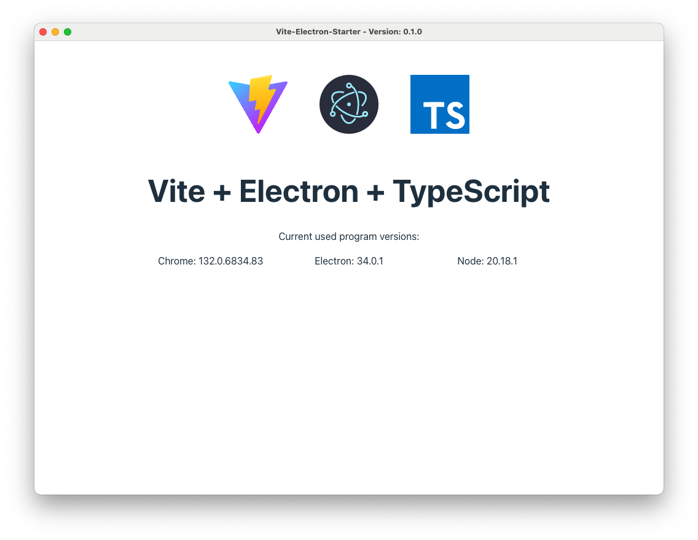
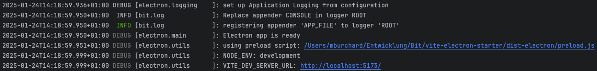
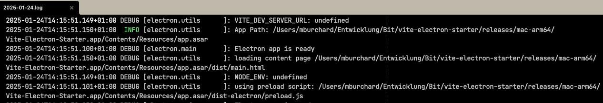

# vite-electron-starter

## Introduction
This starter template provides a quick and easy way to build [Electron](https://www.electronjs.org/) apps with [TypeScript](https://www.typescriptlang.org/).
It supports Hot Module Replacement (HMR) for the Electron main process, the preload script, and the app itself.
The entire setup uses [Vite](https://vite.dev/) in a clear, transparent manner, no hidden “black magic” in third-party plugins.

## Features
### Logging
Since logging is essential for many developers, this project offers a ready-to-use and production-ready logging solution of my own: [bit-log](https://github.com/MBurchard/bit-log)

